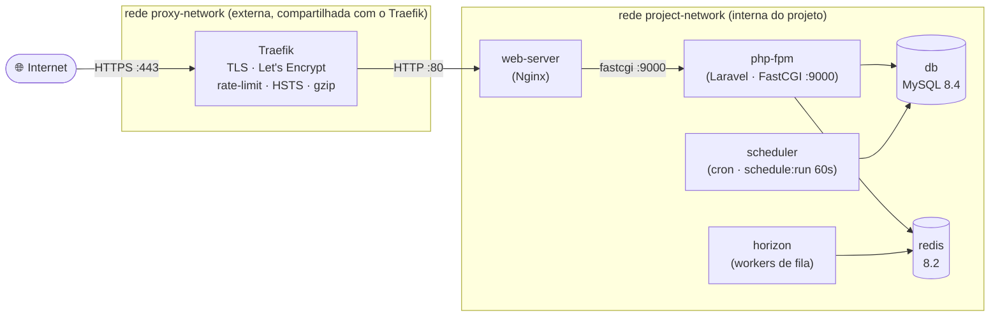

# laravel-docker-stack

Estrutura **Docker pronta para produção** para projetos **Laravel** — Nginx + PHP-FPM + MySQL +
Redis + Horizon + Scheduler atrás do **Traefik**, com scripts de deploy/versionamento/rollback,
backups automatizados e Log Viewer. Você copia para a raiz do seu projeto Laravel, troca um
macro pelo nome do projeto e sobe.

**Stack:** Laravel · PHP 8.4 · MySQL 8.4 · Redis 8.2 · Nginx 1.28 · Docker Compose · Traefik

| Documento | Cobre |
|---|---|
| **Este README** | Visão geral, como usar no seu projeto, substituição do macro, subir/operar |
| 🐳 [`docker/README.md`](docker/README.md) | Estrutura Docker a fundo: serviços, build, config PHP/Nginx, rede, volumes, runtime `.env` |
| 🛠️ [`scripts/README.md`](scripts/README.md) | Scripts a fundo: deploy, versionamento/rollback, backups, logs, phartisan/clean_logs |
| 🧩 [`laravel/README.md`](laravel/README.md) | Glue da aplicação: pacotes, arquivos a copiar e trechos a mesclar |

---

## Índice

1. [O que está incluído](#o-que-está-incluído)
2. [Visão geral da arquitetura](#visão-geral-da-arquitetura)
3. [Como usar no seu projeto](#como-usar-no-seu-projeto)
4. [Substituindo o macro](#substituindo-o-macro)
5. [Pré-requisitos](#pré-requisitos)
6. [Subindo em produção](#subindo-em-produção)
7. [Subindo em desenvolvimento](#subindo-em-desenvolvimento)
8. [Operação](#operação)
9. [Configuração (`.env`)](#configuração-env)
10. [Colaboração](#colaboração)

---

## O que está incluído

```
docker/          # 1 ambiente por pasta (production/ e development/): compose, Dockerfiles, nginx, php-fpm
scripts/         # deploy, phartisan, phcomposer, dockerbuild, clean_logs
laravel/         # glue da aplicação (config, middleware, provider) — ver laravel/README.md
.dockerignore
.env.stack.example   # variáveis usadas pela stack, para mesclar no seu .env
```

O stack é feito para **viver na raiz de um projeto Laravel existente** (os Dockerfiles fazem
`COPY . .` e compilam os assets do seu `resources/` via Vite).

---

## Visão geral da arquitetura

Tudo roda em containers orquestrados por **Docker Compose**, com **um arquivo por ambiente**.
Nenhuma porta HTTP é exposta diretamente: o único ponto de entrada externo é o **Traefik**, que
roteia e (em produção) termina o TLS.



| Serviço | Função |
|---|---|
| `web-server` | Nginx: recebe do Traefik, serve estáticos/assets e repassa o PHP |
| `php-fpm` | Executa a aplicação Laravel (container que os scripts acessam) |
| `horizon` | Processa as filas sobre Redis |
| `scheduler` | Roda `schedule:run` a cada 60s (cron do Laravel) |
| `db` / `redis` | Banco MySQL · cache/sessão/fila no Redis |
| `mailpit` *(dev)* | Captura todo e-mail SMTP, com Web UI |

**Produção × desenvolvimento:** em prod a imagem é **imutável e versionada** (código embutido →
rollback rápido); em dev o código é **bind-mounted** (alterações na hora) + Xdebug + Mailpit.

> 🐳 Detalhes de cada serviço, build, rede e volumes: [`docker/README.md`](docker/README.md).

---

## Como usar no seu projeto

1. **Copie a estrutura** para a raiz do seu projeto Laravel:
   ```sh
   cp -r laravel-docker-stack/{docker,scripts,.dockerignore} ./meu-projeto/
   ```
2. **Configure o lado Laravel** (pacotes + arquivos de glue) seguindo [`laravel/README.md`](laravel/README.md)
   (`composer require laravel/horizon laravel/pulse opcodesio/log-viewer spatie/laravel-backup` + copiar/mesclar os arquivos).
3. **Mescle as variáveis** do [`.env.stack.example`](.env.stack.example) no seu `.env`.
4. **Substitua o macro `{{project-name}}`** pelo nome do seu projeto — ver [seção abaixo](#substituindo-o-macro).
5. **Suba o Traefik** ([pré-requisitos](#pré-requisitos)) e rode o deploy ([produção](#subindo-em-produção) / [desenvolvimento](#subindo-em-desenvolvimento)).

---

## Substituindo o macro

Todos os nomes específicos do projeto nos arquivos de config aparecem como o macro
**`{{project-name}}`** (containers, imagens, volumes, *project name* do Compose, routers/labels do
Traefik, etc.). Antes de subir, troque o macro pelo nome do seu projeto (use **kebab-case**, ex.:
`minha-loja`):

```sh
# na raiz do projeto — substitui em todos os arquivos (config + exemplos das docs)
grep -rlI '{{project-name}}' . --exclude-dir=.git | xargs sed -i 's/{{project-name}}/minha-loja/g'
```

### Onde o macro está

| Arquivo | Ocorrências | O que o macro nomeia |
|---|---|---|
| `docker/production/docker-compose.yml` | 46 | containers, imagens, volumes, project-name, routers/middlewares Traefik, labels |
| `docker/development/docker-compose.yml` | 46 | idem (ambiente de desenvolvimento) |
| `scripts/deploy` | 11 | imagens/volumes, project-name do Compose, detecção de container |
| `scripts/phartisan` · `scripts/phcomposer` | 3 cada | seleção do container `php-fpm` em execução |
| `scripts/dockerbuild` | 1 | project-name do Compose |
| `scripts/clean_logs` | 1 | detecção do container `php-fpm` |
| `docker/production/{php-fpm,nginx}/Dockerfile` | 1 cada | título OCI da imagem |
| `docker/development/{php-fpm,nginx}/Dockerfile` | 1 cada | título OCI da imagem |
| `.env.stack.example` | 5 | `APP_NAME`, `APP_URL`, `DB_DATABASE`, `DB_USERNAME` |

> Os exemplos em `docker/README.md` (13×) e `scripts/README.md` (8×) também usam o macro — o
> find/replace global acima já cuida deles.

> [!IMPORTANT]
> **Domínio:** além do macro, troque `example.com` pelo seu domínio real em
> `docker/production/docker-compose.yml` (linhas **3** e **63**) e no `APP_URL` do `.env`. Em
> desenvolvimento o host é `{{project-name}}.local` (sem domínio).

> [!NOTE]
> **Autoria (opcional):** os Dockerfiles trazem os labels OCI `org.opencontainers.image.authors`
> e `org.opencontainers.image.source` apontando para o autor/repositório do stack. Se quiser que
> as imagens que **você** buildar sejam atribuídas a você, ajuste esses dois labels.

---

## Pré-requisitos

**1. Traefik (reverse proxy externo).** O stack não sobe um proxy próprio — conecta-se a uma
instância do Traefik que roda separadamente. Uma configuração pronta (prod com HTTPS/Let's
Encrypt, dev em HTTP) está em **[github.com/Fabriciope/traefik-setup](https://github.com/Fabriciope/traefik-setup)**.

> [!IMPORTANT]
> O Traefik precisa estar **rodando antes** de subir o stack em qualquer ambiente.

**2. Rede Docker compartilhada** (uma única vez na máquina):

```sh
docker network create proxy-network
```

**3. Ferramentas no host:** Docker + Docker Compose v2; Bash + `sudo` (o deploy de prod ajusta
permissões do `.env`/logs); Node + npm em dev (assets compilados no host).

---

## Subindo em produção

> [!TIP]
> A maioria dos scripts aceita **`--help`**; `deploy` e `clean_logs` aceitam **`--dry-run`**.
> Passo a passo detalhado em [`scripts/README.md`](scripts/README.md).

Com o macro já substituído e o `.env` configurado:

```sh
# 1. suba o Traefik de produção (no repositório traefik-setup)
docker compose -f production/docker-compose.yml up -d

# 2. primeiro deploy (cria volumes/symlink/permissões + key:generate + migrate --seed)
./scripts/deploy prod --first-deploy

# 3. releases seguintes
./scripts/deploy prod --version 1.1.0      # nova versão (build + tag 1.1.0-prod)
./scripts/deploy prod --skip-build         # só recria containers (ex.: mudou só o .env)
```

> O que o `--first-deploy` prepara: [`scripts/README.md › Primeiro deploy`](scripts/README.md#primeiro-deploy).

---

## Subindo em desenvolvimento

```sh
# 1. Traefik de dev (no traefik-setup) + /etc/hosts
docker compose -f development/docker-compose.yml up -d
echo '127.0.0.1 {{project-name}}.local'         | sudo tee -a /etc/hosts
echo '127.0.0.1 {{project-name}}-mailpit.local' | sudo tee -a /etc/hosts

# 2. assets (no host) e deploy
npm install && npm run build      # ou `npm run dev` para HMR
./scripts/deploy dev --first-deploy
```

App em **http://{{project-name}}.local** · e-mails capturados pelo Mailpit em
**http://{{project-name}}-mailpit.local**.

---

## Operação

Tarefas do dia a dia (detalhes em [`scripts/README.md`](scripts/README.md)):

```sh
# Releases / rollback
./scripts/deploy prod --version 1.2.0    # nova versão
./scripts/deploy prod --list-versions    # versões no disco
./scripts/deploy prod --rollback 1.1.0   # volta para a 1.1.0 (sem build)

# Backups (rodam sozinhos no scheduler; manual:)
./scripts/phartisan backup:run --only-db
./scripts/phartisan backup:list

# Logs
./scripts/clean_logs --list              # lista os .log
#   visualização no navegador: /log-viewer (Basic Auth)
```

> [!WARNING]
> Rollback reverte só o código/imagem — **as migrations do banco NÃO são revertidas**. Mecânica
> em [`scripts/README.md › Versionamento e rollback`](scripts/README.md#versionamento-e-rollback).

---

## Configuração (`.env`)

As variáveis usadas pela stack estão em [`.env.stack.example`](.env.stack.example) — mescle no
`.env` do seu projeto. O `.env` é **bind-mounted** em runtime e nunca entra na imagem, então
alterá-lo **não exige rebuild** (use `./scripts/deploy prod --skip-build`). O porquê está em
[`docker/README.md › Configuração em runtime`](docker/README.md#configuração-em-runtime-env).

| Grupo | Variáveis | Observação |
|---|---|---|
| App | `APP_NAME`, `APP_ENV`, `APP_URL`, `APP_KEY` | `APP_KEY` é gerado no `--first-deploy` |
| Banco | `DB_HOST=db`, `DB_DATABASE`, `DB_USERNAME`, `DB_PASSWORD`, `DB_ROOT_PASSWORD` | `DB_ROOT_PASSWORD` usado em backup/restore |
| Redis | `REDIS_HOST=redis`, `REDIS_PASSWORD` | senha deve casar com o compose |
| Drivers | `CACHE_STORE`, `SESSION_DRIVER`, `QUEUE_CONNECTION` | `redis` em prod (Horizon exige) |
| Infra | `PROJECT_VERSION`, `PROJECT_VERSIONS_TO_KEEP` | versionamento de imagens (gerenciado pelo `deploy`) |
| Log Viewer | `LOG_VIEWER_AUTH_USER`, `LOG_VIEWER_AUTH_PASSWORD` | defina em produção (senão `/log-viewer` fica bloqueado) |
| Backup | `BACKUP_NOTIFICATION_EMAIL`, `BACKUP_ARCHIVE_PASSWORD` | alertas e cifragem do `.zip` |

---

## Colaboração

Melhorias e correções na estrutura são bem-vindas:

- **Issue** — descreva o problema ou a ideia.
- **Pull Request** — fork → branch (`infra/...` ou `docs/...`) → PR contra `main`.

Ao mexer na estrutura, mantenha a documentação em dia (cada área tem o seu README) e preserve o
macro `{{project-name}}` nos arquivos de config. Commits seguem
[Conventional Commits](https://www.conventionalcommits.org/).

---

Autor: [Fabriciope](https://github.com/Fabriciope) · Licença: [MIT](LICENSE)
