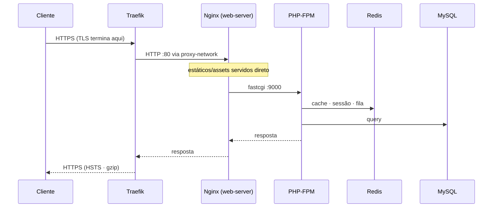

# Estrutura Docker — {{project-name}}

Documentação **técnica** da infraestrutura Docker: como os serviços são montados, como as
imagens são construídas e por que cada decisão foi tomada.

> 📘 **Como usar/operar** (subir, deploy, backup, logs): [README da raiz](../README.md) ·
> 🛠️ **Scripts** (deploy, phartisan, clean_logs…): [`scripts/README.md`](../scripts/README.md)

Para a visão geral da arquitetura (diagrama de topologia + tabela de serviços), veja
[README da raiz › Visão geral](../README.md#visão-geral-da-arquitetura).

---

## Índice

1. [Estrutura de diretórios](#estrutura-de-diretórios)
2. [Serviços](#serviços)
3. [Build das imagens](#build-das-imagens)
4. [Configuração de PHP e Nginx](#configuração-de-php-e-nginx)
5. [Rede e portas](#rede-e-portas)
6. [Volumes e persistência](#volumes-e-persistência)
7. [Configuração em runtime (`.env`)](#configuração-em-runtime-env)
8. [Imagens versionadas](#imagens-versionadas)
9. [Colaboração](#colaboração)

---

## Estrutura de diretórios

Cada ambiente é um **diretório autocontido**, com o seu próprio `docker-compose.yml`,
Dockerfiles e arquivos de configuração. Os dois lados têm **a mesma estrutura** — muda apenas o
conteúdo.

```
docker/
├── development/
│   ├── docker-compose.yml
│   ├── nginx/
│   │   ├── Dockerfile
│   │   └── nginx.conf
│   └── php-fpm/
│       ├── Dockerfile
│       ├── docker-entrypoint.sh     # só em dev (composer install no 1º start)
│       ├── 99-overrides.ini         # overrides do php.ini
│       └── php-fpm-overrides.conf   # pool/workers do php-fpm
└── production/
    ├── docker-compose.yml
    ├── nginx/
    │   ├── Dockerfile
    │   └── nginx.conf
    └── php-fpm/
        ├── Dockerfile
        ├── 99-overrides.ini
        └── php-fpm-overrides.conf
```

**Como o ambiente é selecionado:** os scripts recebem o atalho `prod`/`dev` e resolvem o
diretório e o *project name* do Compose — você nunca digita caminhos.

| Atalho | Diretório | Project name (Compose) |
|---|---|---|
| `prod` | `docker/production/` | `{{project-name}}_production` |
| `dev` | `docker/development/` | `{{project-name}}_development` |

O mapeamento é feito por `deploy`, `dockerbuild`, `phartisan` e `phcomposer` — ver
[`scripts/README.md`](../scripts/README.md).

**Ver o que muda entre ambientes:** como a estrutura é espelhada, basta comparar os arquivos
equivalentes:

```sh
diff docker/development/php-fpm/99-overrides.ini docker/production/php-fpm/99-overrides.ini
diff docker/development/nginx/nginx.conf         docker/production/nginx/nginx.conf
diff docker/development/docker-compose.yml       docker/production/docker-compose.yml
```

---

## Serviços

Cada serviço de produção tem `restart: always`, `healthcheck` e logging com rotação
(`json-file`, `max-size: 10m`, `max-file: 3`). A ordem de subida é garantida por `depends_on`
com `condition: service_healthy`: `db`/`redis` saudáveis → `php-fpm` saudável → `web-server`.

### `web-server` (Nginx)

Ponto de entrada interno. Recebe o tráfego do Traefik e:

- Serve estáticos e os assets do Vite (`/build/*`) **direto do disco**.
- Repassa requisições PHP ao `php-fpm` via FastCGI (`php-fpm:9000`).
- Aplica headers de segurança (`X-Frame-Options`, `X-Content-Type-Options`, `Referrer-Policy`,
  e `Permissions-Policy` só em prod), bloqueia dotfiles e responde `404` em `/logs`.
- **Em produção**, repassa o header `Authorization` ao PHP (`fastcgi_param HTTP_AUTHORIZATION`).
  Isso é **necessário** para o Basic Auth do Log Viewer, porque o php-fpm não popula
  `PHP_AUTH_USER` sozinho — o middleware parseia o header na mão. (Operação do Log Viewer em
  [`scripts/README.md › Logs e Log Viewer`](../scripts/README.md#logs-e-log-viewer).)

Os labels do Traefik (router, `entrypoints=websecure`, `tls`/`certresolver=letsencrypt` e os
middlewares `ratelimit`, `hsts`, `compress`) ficam neste serviço, no compose de produção.

### `php-fpm`

Executa a aplicação. Monta o `.env`, o volume `public-storage`, `storage/app/backups` e
`storage/logs`. Healthcheck via `cgi-fcgi -bind -connect 127.0.0.1:9000`. É o container que os
scripts `phartisan`/`phcomposer` acessam.

### `horizon`

Mesma imagem do `php-fpm`, com `command: php artisan horizon` — processa as filas no Redis.
Tem `stop_signal: SIGTERM` + `stop_grace_period: 30s` para terminar os jobs em andamento de
forma limpa (graceful shutdown) antes de o container morrer.

### `scheduler`

Mesma imagem, rodando `while true; do php artisan schedule:run --verbose --no-interaction; sleep 60; done`
— o "cron" do Laravel. É ele quem dispara os backups agendados (detalhes em
[`scripts/README.md › Backups`](../scripts/README.md#backups)).

### `db` (MySQL 8.4.3) e `redis` (8.2.1)

Persistem em volumes dedicados (ver [Volumes](#volumes-e-persistência)). Ambos publicam a porta
**apenas em `127.0.0.1`** (ver [Rede e portas](#rede-e-portas)). O Redis sobe com
`--requirepass` e política `--maxmemory 100mb --maxmemory-policy allkeys-lru` (cache que descarta
as chaves menos usadas ao encher).

### Extras de desenvolvimento

- **`mailpit`** — servidor SMTP fake; captura os e-mails e expõe uma Web UI via Traefik
  (`{{project-name}}-mailpit.local`). O SMTP (`1025`) fica só na rede interna.
- **`vite`** — serviço **comentado** no compose de dev; por padrão o Vite roda no host
  (`npm run dev`). Descomente apenas se quiser HMR containerizado.

### Metadados (labels)

Os metadados ficam em **dois níveis**, cada um no lugar certo:

**Labels de container** (`labels:` no `docker-compose.yml`) — identificam a instância em runtime;
valem para **todos** os serviços, inclusive os de imagem de terceiros (`db`, `redis`, `mailpit`):

| Label | Exemplo |
|---|---|
| `com.{{project-name}}.project` | `{{project-name}}` |
| `com.{{project-name}}.service` | `php-fpm`, `horizon`, `db`… |
| `com.{{project-name}}.environment` | `production` / `development` |

**Labels de imagem** (`LABEL` nos Dockerfiles, padrão [OCI](https://github.com/opencontainers/image-spec/blob/main/annotations.md))
— descrevem o **artefato** e viajam com a imagem onde quer que ela vá. Só nas imagens próprias
(`nginx` e `php-fpm`; `horizon`/`scheduler` reusam a do `php-fpm`):

| Label | Conteúdo |
|---|---|
| `org.opencontainers.image.title` | nome da imagem |
| `org.opencontainers.image.description` | função na estrutura |
| `org.opencontainers.image.authors` | mantenedor |
| `org.opencontainers.image.source` | repositório |
| `org.opencontainers.image.licenses` | licença |

> `service` é label de container (não de imagem) porque `php-fpm`, `horizon` e `scheduler`
> compartilham a mesma imagem. O container **herda** os labels da imagem, então o `inspect`
> abaixo mostra os dois níveis juntos.

```sh
# containers de produção do projeto (label de container)
docker ps --filter "label=com.{{project-name}}.environment=production"
# todos os labels de um container (inclui os herdados da imagem)
docker inspect -f '{{ json .Config.Labels }}' {{project-name}}-php-fpm_prod
```

---

## Build das imagens

### Produção — `php-fpm` (multi-stage, imutável)

`docker/production/php-fpm/Dockerfile`:

1. **Stage Node** (`node:20-alpine`) — `npm ci` + `npm run build` geram os assets do Vite.
2. **Stage PHP** (`php:8.4.6-fpm`) — instala extensões (`pdo_mysql`, `redis`, `ds`, `gd`,
   `intl`, `bcmath`, `pcntl`, `soap`, `zip`), aplica os overrides de `php.ini`/`php-fpm` e:
   - **Cache de camadas do Composer:** copia só `composer.json`/`composer.lock` e roda
     `composer install --no-scripts` **antes** do `COPY . .`. Assim o `install` só re-executa
     quando as dependências mudam, não a cada alteração de código. O `package:discover` (do
     `post-autoload-dump`) roda manualmente depois, quando o `artisan` já existe.
   - **`COPY . .`** embute o código na imagem — origem da imutabilidade e do
     [rollback por versão](#imagens-versionadas).
   - Copia `public/build/` do stage Node e cria o symlink `public/storage → ../storage/app/public`.
   - **Remove caches compilados** (`bootstrap/cache/*.php`): um `config.php` assado sem o `.env`
     real sobrescreveria a config de runtime e quebraria o app. O cache correto é gerado pelo
     `optimize` do deploy, já com o `.env` montado.
   - Define `HOME=/home/www-data` **gravável** (sem isso o Tinker/PsySH falha ao escrever
     histórico/config) e roda como usuário `www-data`.

O **Nginx** de produção segue o mesmo padrão multi-stage: copia o código e os assets, cria o
symlink de storage e ajusta o dono — para servir tudo sem bind mount do host.

### Desenvolvimento — bind mount + Xdebug

`docker/development/php-fpm/Dockerfile`:

- Usa `php.ini-development` e adiciona **Xdebug** (porta 9003, conecta ao IDE via
  `host.docker.internal`, resolvido por `extra_hosts` no compose).
- **Alinha o UID/GID** do `www-data` ao usuário do host (`HOST_UID`/`HOST_GID`, padrão 1000)
  para o php-fpm conseguir escrever nos arquivos bind-mounted sem erro de permissão.
- Um **entrypoint** roda `composer install` automaticamente no primeiro start, caso `vendor/`
  ainda não exista.

Em dev, **não há `COPY . .`**: o código é bind-mounted (`./:/var/www`), então o build só precisa
acontecer ao mudar o `Dockerfile`/extensões.

### `.dockerignore`

Mantém o contexto de build enxuto e seguro: exclui `vendor/`, `node_modules/`, `.env*` (exceto
`.env.example`), `.git`, `scripts/`, os caches compilados (`bootstrap/cache/*.php`) e o SQLite
de dev.

---

## Configuração de PHP e Nginx

Os arquivos vivem em `docker/<ambiente>/{php-fpm,nginx}/`. As diferenças principais:

| Aspecto | Produção | Desenvolvimento |
|---|---|---|
| `php.ini` base | `php.ini-production` | `php.ini-development` |
| OPcache | `validate_timestamps=0` (cache fixo) | `validate_timestamps=1`, `revalidate_freq=2` |
| Erros PHP | `display_errors=Off` (só log) | `display_errors=On` |
| Xdebug | ❌ | ✅ porta 9003 |
| UID/GID `www-data` | padrão | alinhado ao host (1000) |
| Nginx `client_max_body_size` | 11M | 50M |
| Nginx — bloqueios | `/logs` e `/_debugbar` → 404 | só `/logs` (Debugbar liberado) |

> **Comuns aos dois:** `memory_limit=256M`, `upload_max_filesize=20M`, `post_max_size=21M`,
> `max_execution_time=60`, timezone `America/Sao_Paulo`, pool php-fpm `pm.max_children=10`
> (`start_servers=3`, `max_requests=500`).

O log de erros do PHP vai para `storage/logs/php-fpm/www.app.log`, o do master php-fpm para
`php-fpm.log`, e o access log do pool (formato custom) para `www.access.log`. Para ver qualquer
diferença com precisão, compare os arquivos equivalentes (ver [Estrutura de diretórios](#estrutura-de-diretórios)).

---

## Rede e portas

| Rede | Tipo | Quem participa | Para quê |
|---|---|---|---|
| `proxy-network` | externa | Traefik, `web-server`, `mailpit` (dev) | entrada de tráfego HTTP(S) |
| `project-network` | interna | todos os serviços do projeto | comunicação interna (DB, Redis, FastCGI) |

O `php-fpm` **não** está na `proxy-network` — só o Nginx fala com o mundo externo, sempre via
Traefik. Isso reduz a superfície de ataque: banco, Redis e o runtime PHP nunca são alcançáveis
de fora.



**Portas no host:** nenhuma porta HTTP/HTTPS é publicada pelo projeto (o Traefik é a única
entrada). Só o banco e o Redis expõem portas — **restritas a `127.0.0.1`** — em valores
diferentes por ambiente, para não conflitar caso prod e dev rodem na mesma máquina:

| Serviço | Produção | Desenvolvimento |
|---|---|---|
| MySQL | `127.0.0.1:3307` | `127.0.0.1:3308` |
| Redis | `127.0.0.1:6380` | `127.0.0.1:6381` |

---

## Volumes e persistência

Em produção, os dados ficam em **volumes externos** (criados no `--first-deploy`): sobrevivem a
`docker compose down` e à troca de versão de imagem. O que precisa ser acessível/editável no host
é **bind mount**.

| Caminho | Tipo | Conteúdo |
|---|---|---|
| `{{project-name}}_db_data` | volume externo | dados do MySQL |
| `{{project-name}}_redis_data` | volume externo | dump do Redis |
| `{{project-name}}_public_storage` | volume externo | uploads públicos (`storage/app/public`), compartilhado entre os containers |
| `./.env` | bind mount | config e segredos (fora da imagem) |
| `./storage/logs` | bind mount | logs de todos os containers |
| `./storage/app/backups` | bind mount | dumps do banco (spatie) |

> **`public/` não é bind mount em produção** — é embutido na imagem (código + assets + symlink de
> storage). Isso preserva a imutabilidade da imagem e o rollback por versão. O único conteúdo
> dinâmico de `public/` são os uploads, servidos via volume `public-storage` montado em
> `storage/app/public`.

Em **desenvolvimento**, os volumes são **locais** (`db-data`, `redis-data`, `mailpit-data`,
descartáveis com `docker compose down -v`) e o código-fonte inteiro é bind-mounted em `/var/www`.

---

## Configuração em runtime (`.env`)

O `.env` é **bind-mounted** nos containers e **nunca** entra na imagem (está no `.dockerignore`).
Decisão deliberada:

- **Segredos fora da imagem** — a imagem pode ser reconstruída/versionada sem carregar senhas.
- **Trocar config sem rebuild** — alterar o `.env` só exige recriar os containers
  (`deploy prod --skip-build`), não um build novo.

Como o `.env` é montado em runtime e o `config:cache` é gerado pelo `optimize` do deploy (com o
`.env` já presente), a config sempre reflete o ambiente real — nunca um snapshot assado no build.

> O deploy de produção reescreve o ponteiro `PROJECT_VERSION` no `.env` e re-aplica
> dono/permissões (`www-data`, `chmod 660`) — o que explica o `sudo` no deploy. O porquê dessa
> mecânica está em [`scripts/README.md › deploy`](../scripts/README.md#deploy). A referência das
> variáveis está no [README da raiz › Configuração](../README.md#configuração-env).

---

## Imagens versionadas

A tag da imagem de cada serviço de produção é **interpolada** por `PROJECT_VERSION` no compose:

```yaml
image: {{project-name}}-php-fpm:${PROJECT_VERSION:-1.0.0}-prod
```

É isso que viabiliza o **rollback sem rebuild**: cada release fica armazenada como uma imagem
`<versão>-prod`, e voltar para uma versão anterior é só subir os containers a partir da imagem já
existente. Em dev as tags são estáticas (`:1.0.0-dev`), pois o código é bind-mounted.

O **fluxo completo** de versionar, listar e fazer rollback (incluindo o prune das versões
antigas) é operado pelo `deploy` — ver
[`scripts/README.md › Versionamento e rollback`](../scripts/README.md#versionamento-e-rollback).

---

## Colaboração

Encontrou algo que pode melhorar na estrutura Docker (um serviço, o build, a rede, um volume)?
Contribuições são bem-vindas:

- **Issue** — descreva o problema ou a ideia.
- **Pull Request** — fork → branch (`infra/...`) → PR contra `main`.

Ao alterar qualquer `docker-compose.yml`, `Dockerfile` ou arquivo de config, **atualize a seção
correspondente deste README**. Mudanças que afetem a operação devem refletir também em
[`scripts/README.md`](../scripts/README.md).
