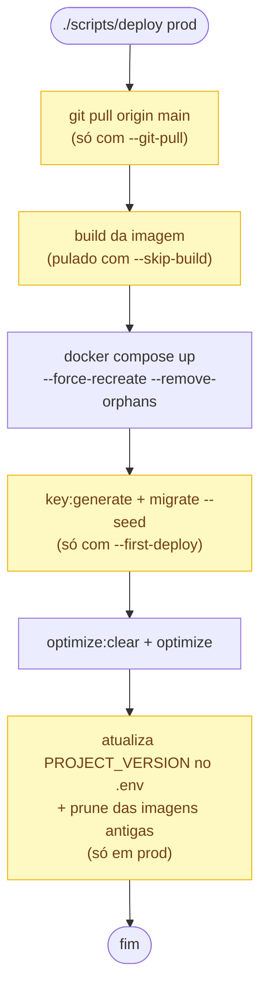
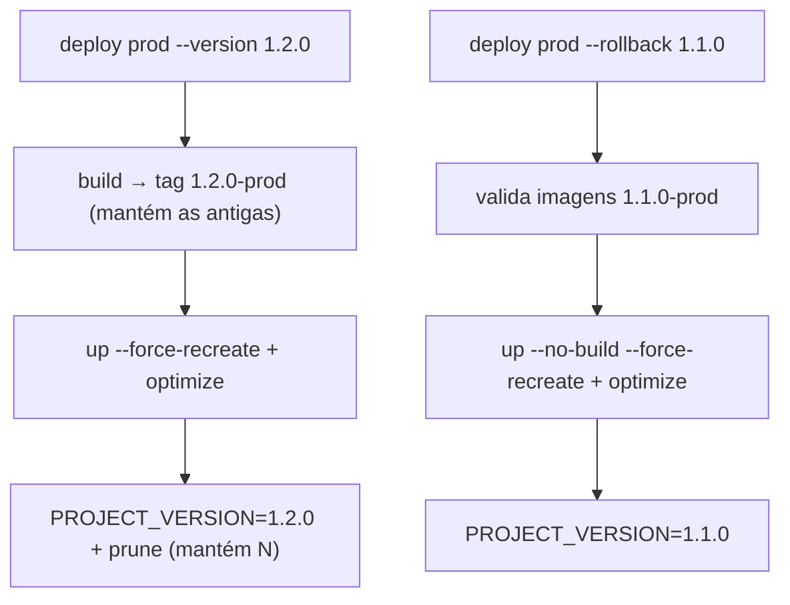

# Scripts operacionais — {{project-name}}

Documentação **técnica** dos scripts que operam a infraestrutura: o que cada um faz por baixo
dos panos e como usá-los a fundo.

> 📘 **Como subir/usar** o projeto: [README da raiz](../README.md) ·
> 🐳 **Estrutura Docker** (serviços, build, rede, volumes): [`docker/README.md`](../docker/README.md)

**Convenções:**

- Os wrappers de container (`phartisan`, `phcomposer`, `dockerbuild`) **detectam o ambiente
  automaticamente** pelo container `php-fpm` em execução (`{{project-name}}-php-fpm_prod` ou `_dev`).
- A maioria aceita **`--help`** (uso completo); `deploy` e `clean_logs` aceitam **`--dry-run`**
  (mostra o que fariam, sem executar).

---

## Índice

1. [`deploy`](#deploy)
   - [Versionamento e rollback](#versionamento-e-rollback)
   - [Primeiro deploy](#primeiro-deploy)
   - [Quando rebuildar (`--skip-build`)](#quando-rebuildar---skip-build)
2. [`phartisan` e `phcomposer`](#phartisan-e-phcomposer)
3. [`dockerbuild`](#dockerbuild)
4. [`clean_logs`](#clean_logs)
5. [Backups](#backups)
6. [Logs e Log Viewer](#logs-e-log-viewer)
7. [Colaboração](#colaboração)

---

## `deploy`

Orquestra todo o ciclo de deploy. As etapas de um deploy normal, na ordem — as que dependem de
flags ou do ambiente estão **destacadas**:



> Em amarelo: etapas **condicionais** (dependem de flags ou do ambiente); as demais rodam sempre.

**Robustez:** usa um **lockfile** (`/tmp/deploy.lock`, via `flock`) que impede dois deploys
simultâneos; registra cada passo em `storage/logs/deploy.log`; e imprime um **resumo** colorido
ao final (comandos com ✓/✗). Antes de rodar, valida que `dockerbuild` e `phartisan` existem e são
executáveis.

```
./scripts/deploy <prod|dev> [opções]

  --version <v>    Versão de um NOVO deploy de prod (gera imagens <v>-prod).
                   Sem ela, um deploy de prod reconstrói a versão atual.
  --rollback <v>   Recria os containers de prod a partir das imagens <v>-prod já
                   armazenadas (sem build). NÃO reverte migrations.
  --list-versions  Lista as versões de imagem de prod no disco e sai.
  --git-pull       git pull origin main antes do build (prod).
  --skip-build     Pula o build; só recria os containers.
  --first-deploy   Setup de infraestrutura + key:generate + migrate --seed.
  --dry-run        Mostra os comandos sem executá-los.
  --help           Ajuda.
```

> As flags `--version`, `--rollback` e `--list-versions` são **exclusivas de produção** (em dev o
> código é bind-mounted; ver [`docker/README.md › Imagens versionadas`](../docker/README.md#imagens-versionadas)).
> `--rollback` e `--version` são mutuamente exclusivas; `--rollback` não combina com `--git-pull`
> nem `--first-deploy`.

### Versionamento e rollback

Cada serviço de prod sobe a partir de uma imagem `:<versão>-prod`, cuja tag é interpolada por
`PROJECT_VERSION` no compose ([detalhe em `docker/README.md`](../docker/README.md#imagens-versionadas)).
O `deploy` é quem gerencia esse ponteiro e o ciclo de vida das imagens:

- **Nova versão** (`--version <v>`): faz `build` e tagueia as imagens como `<v>-prod` **sem
  apagar** as anteriores; ao final, atualiza `PROJECT_VERSION=<v>` no `.env` e roda o **prune**,
  mantendo as `PROJECT_VERSIONS_TO_KEEP` versões mais recentes por serviço (padrão 5; imagens em
  uso por um container são puladas com segurança).
- **Rollback** (`--rollback <v>`): valida que existem imagens `<v>-prod` para os 4 serviços
  (`web-server`, `php-fpm`, `horizon`, `scheduler`), sobe com `up --no-build --force-recreate`
  (**nenhum build**) e atualiza o ponteiro.



```sh
./scripts/deploy prod --version 1.2.0    # lança a versão 1.2.0
./scripts/deploy prod --list-versions    # versões no disco (marca a atual)
./scripts/deploy prod --rollback 1.1.0   # volta para a 1.1.0 (sem build)
```

> [!WARNING]
> O rollback reverte **apenas o código/imagem** — o **schema do banco NÃO é revertido**. Se a
> versão mais nova aplicou migrations incompatíveis, avalie manualmente (ex.: backup +
> `migrate:rollback`). O script exibe esse aviso ao final.

**Por que o deploy mexe no `.env` (e pede `sudo`):** ao reescrever `PROJECT_VERSION`, o `sed`
troca o inode do arquivo e derruba o grupo `www-data` — deixando o php-fpm sem conseguir ler o
`.env`. O script então re-aplica `chown :www-data` + `chmod 660` (grupo `www-data`, modo 660). O
`g+w` também é exigido pelo `key:generate` no primeiro deploy, que escreve o `APP_KEY` de dentro
do container.

### Primeiro deploy

`--first-deploy` faz o preparo de infraestrutura **idempotente** (pula o que já existe) e, ao
final, roda `key:generate` e `migrate --seed --force`. Passos:

- Ajusta dono/permissões do `.env` para `www-data` (`chmod 660`) — **só em prod**.
- Cria `storage/logs/{nginx,php-fpm}` e os arquivos de log (`nginx/access|error`,
  `php-fpm/php-fpm|www.access|www.app`, `laravel`, `deploy`; + `xdebug` em dev) com `chmod 666`.
- **Prod:** cria os volumes externos (`{{project-name}}_db_data`, `{{project-name}}_redis_data`).
  **Dev:** usa volumes locais, então pula esse passo.
- Cria o symlink `public/storage → ../storage/app/public` e o esqueleto de `storage/app`
  (`public/`, `private/`, `backups/`) — o diretório inteiro é bind mount dos containers.
- **Prod:** ajusta dono/permissões de `storage/app` (`www-data` uid 33, dirs `2775` com
  setgid, arquivos `664`) para o container escrever e o host continuar lendo.
- **Dev:** avisa se a entrada `{{project-name}}.local` estiver faltando no `/etc/hosts`.

> Quer ver exatamente o que ele faria sem executar? `./scripts/deploy prod --first-deploy --dry-run`.

### Quando rebuildar (`--skip-build`)

`--skip-build` pula o `docker compose build` e só recria os containers com a imagem existente.

| Situação | Comando |
|---|---|
| Código PHP / `composer.json` / `Dockerfile` mudaram | `./scripts/deploy prod` |
| Só o `.env` mudou, ou precisa reiniciar containers | `./scripts/deploy prod --skip-build` |

> [!WARNING]
> `--skip-build` após um `git pull` sobe os containers com o código **antigo** da imagem — o
> deploy conclui sem erro, mas as mudanças não aparecem.

---

## `phartisan` e `phcomposer`

Executam **Artisan** e **Composer** dentro do container `php-fpm` em execução. Internamente:

1. Acham o container com `docker ps | grep '^{{project-name}}-php-fpm_(prod|dev)$'`.
2. Derivam o ambiente do sufixo do nome e montam o `docker compose ... exec php-fpm <cmd>`
   (com `--project-name` e `--env-file .env` corretos; usam `-it` quando há TTY).

```sh
./scripts/phartisan migrate
./scripts/phartisan tinker
./scripts/phartisan test
./scripts/phcomposer require vendor/pacote
./scripts/phcomposer dump-autoload
```

> [!IMPORTANT]
> **Nunca** rode `php artisan`/`composer` no host — o Laravel depende das extensões PHP, do MySQL
> e do Redis que só existem dentro dos containers.

---

## `dockerbuild`

Wrapper fino de `docker compose` que resolve o arquivo e o *project name* do ambiente e repassa o
resto dos argumentos. Útil para comandos ad-hoc fora do fluxo do `deploy`:

```sh
./scripts/dockerbuild prod up -d
./scripts/dockerbuild prod logs -f php-fpm
./scripts/dockerbuild prod ps
./scripts/dockerbuild dev down
```

Equivale a `docker compose --project-name {{project-name}}_<ambiente> --file docker/<ambiente>/docker-compose.yml --env-file .env <args>`.

---

## `clean_logs`

**Trunca** (esvazia) os arquivos `.log` de `storage/logs/` em vez de apagá-los: `: > arquivo`
deixa o arquivo com 0 byte mas **preserva o inode, dono, permissões e os file handles** já
abertos pelos processos (nginx, php-fpm, Laravel, Horizon). Assim os logs continuam sendo
escritos no mesmo arquivo, sem recriar nada nem reiniciar containers. Ao final, limpa o cache do
Log Viewer (best-effort).

```sh
./scripts/clean_logs                  # trunca todos os .log
./scripts/clean_logs --list           # apenas lista os arquivos numerados
./scripts/clean_logs --except=1,3     # trunca todos, exceto os índices 1 e 3
./scripts/clean_logs --only=2,4       # trunca SOMENTE os índices 2 e 4
./scripts/clean_logs nginx            # restringe a um subdiretório (nginx, php-fpm)
./scripts/clean_logs --dry-run        # mostra o que faria, sem alterar nada
./scripts/clean_logs --no-cache-clear # não roda o log-viewer:clear-cache ao final
```

`--except` e `--only` são **inversos e mutuamente exclusivos**: `--except` lista o que **não**
truncar; `--only` lista o **único** a truncar (o resto é preservado). Os índices vêm da numeração
do `--list` (rode-o primeiro para descobri-los).

---

## Backups

Backup do banco com [`spatie/laravel-backup`](https://spatie.be/docs/laravel-backup), **agendado**
no container `scheduler` (que roda `schedule:run` a cada 60s — ver
[`docker/README.md › Serviços`](../docker/README.md#serviços)):

| Quando | Comando agendado | O que faz |
|---|---|---|
| Diário 01:30 | `backup:clean` | Remove dumps antigos pela política de retenção |
| Diário 02:00 | `backup:run --only-db` | Gera um dump do MySQL (gzip) dentro de um `.zip` |

**Onde ficam:** `storage/app/backups/<APP_NAME>/<data>.zip` — um **bind mount** no host (ver
[`docker/README.md › Volumes`](../docker/README.md#volumes-e-persistência)), então sobrevivem a
deploys e ficam acessíveis para cópia off-site.

**Características:** dump **só do banco** (`--only-db`; o código está no git, o `.env` fica de
fora); consistência InnoDB via `--single-transaction` (sem lock). É **local-only** por opção:
protege contra desastre lógico (migration ruim, `DELETE` acidental), mas **não** contra perda do
host. Para fechar o [3-2-1](https://www.backblaze.com/blog/the-3-2-1-backup-strategy/), replique
`storage/app/backups` para outra máquina (rsync/rclone) ou adicione um disco S3. Configuração em
`config/backup.php`; notificações de falha/saúde via `BACKUP_NOTIFICATION_EMAIL`; cifragem do zip
via `BACKUP_ARCHIVE_PASSWORD`.

```sh
./scripts/phartisan backup:run --only-db   # dump avulso (ex.: antes de um deploy arriscado)
./scripts/phartisan backup:list            # lista backups + saúde (Reachable / Healthy)
./scripts/phartisan backup:clean           # aplica a retenção agora
```

**Restaurar** (o spatie não tem comando de restore — o `.zip` contém o dump gzipado):

```sh
cd storage/app/backups/<APP_NAME>
unzip <data>.zip -d /tmp/restore            # gera /tmp/restore/db-dumps/mysql-<db>.sql.gz
gunzip /tmp/restore/db-dumps/mysql-*.sql.gz
docker exec -i {{project-name}}-database_prod \
  mysql -uroot -p"$DB_ROOT_PASSWORD" "$DB_DATABASE" < /tmp/restore/db-dumps/mysql-*.sql
```

---

## Logs e Log Viewer

Todos os containers escrevem em `storage/logs/` (bind mount). O
[opcodesio/log-viewer](https://log-viewer.opcodes.io) expõe esses arquivos no navegador em
**`/log-viewer`**, com detecção automática do tipo de cada um.

O acesso usa **HTTP Basic Auth com credenciais dedicadas** (não é o login do app), via o
middleware `App\Http\Middleware\LogViewerBasicAuth`:

| Ambiente | Credenciais no `.env` | Acesso a `/log-viewer` |
|---|---|---|
| Produção | definidas | pede usuário/senha |
| Produção | **vazias** | **bloqueado** (fail-closed) |
| Desenvolvimento | vazias | liberado, sem prompt |
| Desenvolvimento | definidas | pede usuário/senha |

> [!IMPORTANT]
> Logs contêm dados sensíveis (stack traces, IPs, dados de clientes). **Sempre** defina
> `LOG_VIEWER_AUTH_USER` e `LOG_VIEWER_AUTH_PASSWORD` em produção. Após alterá-las, recarregue a
> config: `./scripts/phartisan config:cache` (ou um novo deploy).

Em produção, o Nginx repassa o header `Authorization` ao php-fpm para o Basic Auth funcionar —
detalhe em [`docker/README.md › Serviços`](../docker/README.md#serviços). Para **esvaziar** os
logs, use o [`clean_logs`](#clean_logs).

---

## Colaboração

Melhorias e correções nos scripts são bem-vindas:

- **Issue** — descreva o problema ou a ideia.
- **Pull Request** — fork → branch (`infra/...`) → PR contra `main`.

Ao alterar um script, **atualize a seção correspondente deste README** — e, se o comportamento
tocar a estrutura, o [`docker/README.md`](../docker/README.md). Mantenha o estilo dos scripts:
`set -euo pipefail`, mensagens claras e suporte a `--help`/`--dry-run` quando fizer sentido.
